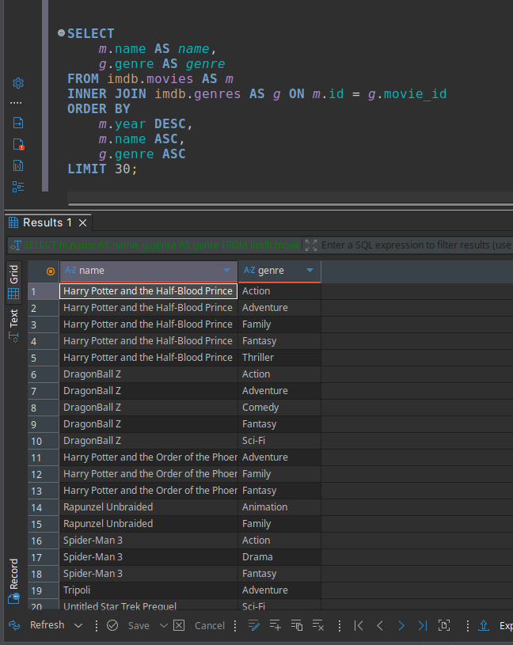
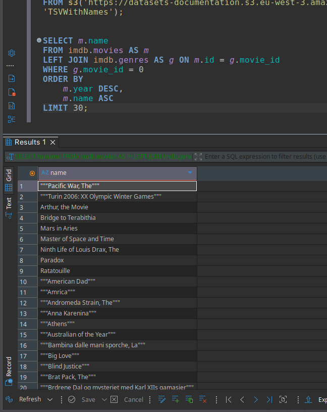
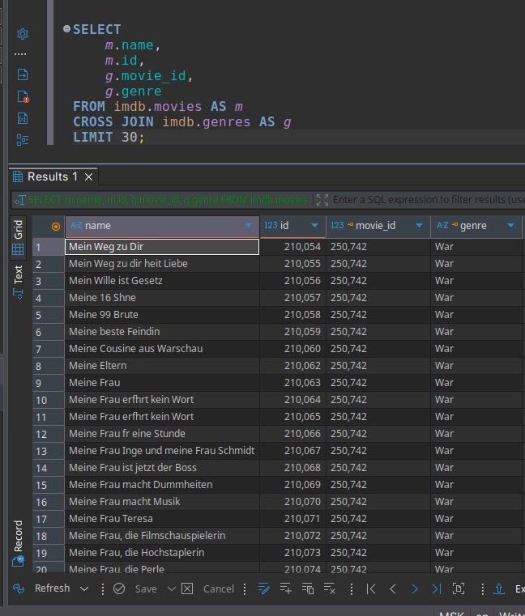
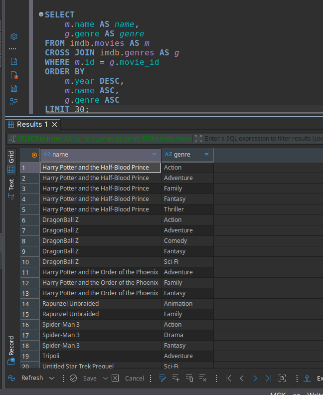
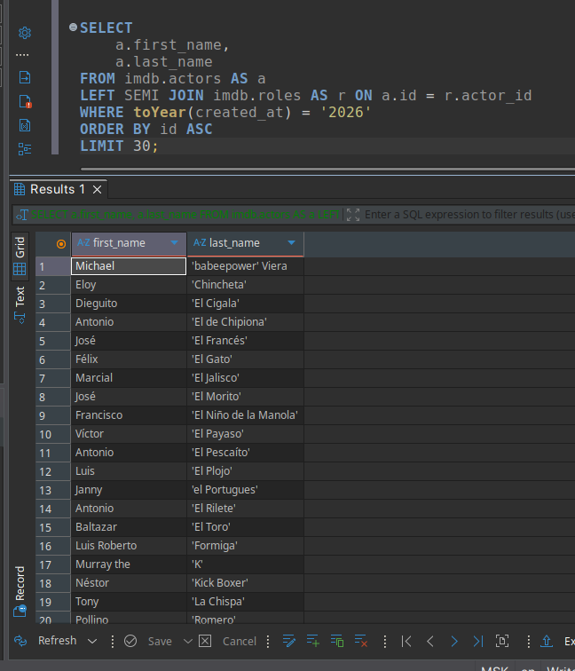
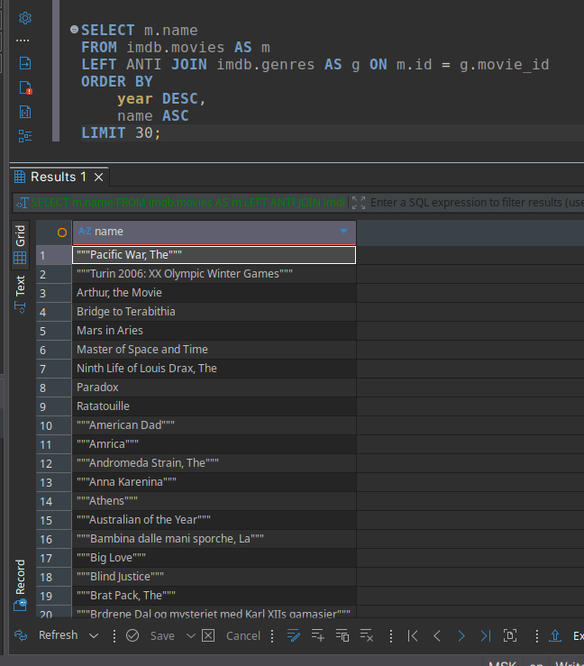

# 1. Поиск жанров для каждого фильма

```sql
SELECT
    m.name AS name,
    g.genre AS genre
FROM imdb.movies AS m
INNER JOIN imdb.genres AS g ON m.id = g.movie_id
ORDER BY
    m.year DESC,
    m.name ASC,
    g.genre ASC
LIMIT 30;
```

### Результат выполнения:



# 2. Поиск фильмов, у которых нет жанра

```sql
SELECT m.name
FROM imdb.movies AS m
LEFT JOIN imdb.genres AS g ON m.id = g.movie_id
WHERE g.movie_id = 0
ORDER BY
    m.year DESC,
    m.name ASC
LIMIT 30;
```

### Результат выполнения:



# 3. Объединить каждую строку из таблицы "Фильмы" с каждой строкой из таблицы "Жанры"

```sql
SELECT
    m.name,
    m.id,
    g.movie_id,
    g.genre
FROM imdb.movies AS m
CROSS JOIN imdb.genres AS g
LIMIT 30;
```

### Результат выполнения:



# 4. Поиск жанров для каждого фильма, не используя INNER JOIN

```sql
SELECT
    m.name AS name,
    g.genre AS genre
FROM imdb.movies AS m
CROSS JOIN imdb.genres AS g
WHERE m.id = g.movie_id
ORDER BY
    m.year DESC,
    m.name ASC,
    g.genre ASC
LIMIT 30;
```

### Результат выполнения:



# 5. Поиск актеров и актрис, снявшихся в фильме в определенном году

```sql
SELECT
    a.first_name,
    a.last_name
FROM imdb.actors AS a
LEFT SEMI JOIN imdb.roles AS r ON a.id = r.actor_id
WHERE toYear(created_at) = '2026'
ORDER BY id ASC
LIMIT 30;
```

### Результат выполнения:



# 6. Поиск фильмов, которые не имеют жанров

```sql
SELECT m.name
FROM imdb.movies AS m
LEFT ANTI JOIN imdb.genres AS g ON m.id = g.movie_id
ORDER BY
    year DESC,
    name ASC
LIMIT 30;
```

### Результат выполнения:


