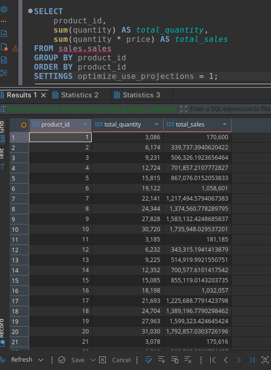
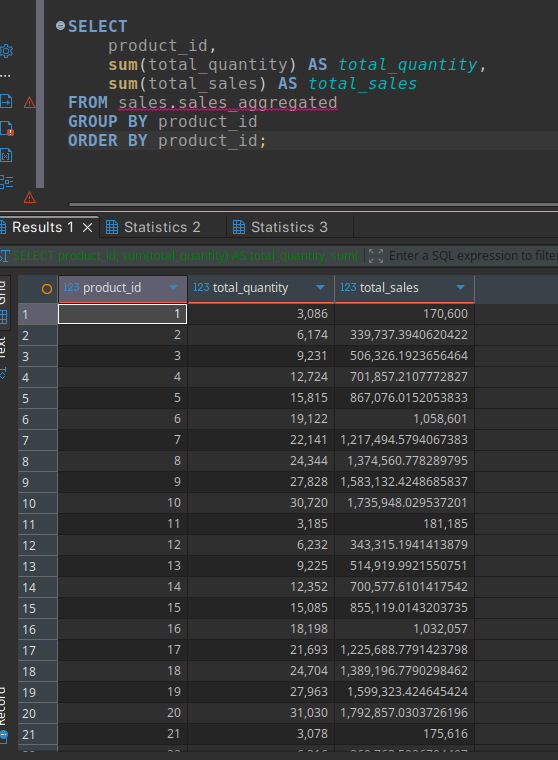

# Создание таблицы

```sql
CREATE TABLE sales (
    id UInt32,
    product_id UInt32,
    quantity UInt32,
    price Float32,
    sale_date DateTime
) ENGINE = MergeTree()
PARTITION BY toYYYYMM(sale_date)
ORDER BY (sale_date, product_id, id);
```

# Создание проекции

```sql
ALTER TABLE sales ADD PROJECTION sales_projection (
    SELECT 
        product_id,
        sum(quantity) AS total_quantity,
        sum(quantity * price) AS total_sales
    GROUP BY product_id
);

ALTER TABLE sales MATERIALIZE PROJECTION sales_projection;
```

# Создание материализованного представления

```sql
CREATE TABLE sales_aggregated (
    product_id UInt32,
    total_quantity UInt64,
    total_sales Float64
) ENGINE = SummingMergeTree()
ORDER BY product_id;

CREATE MATERIALIZED VIEW sales_mv TO sales_aggregated AS
SELECT 
    product_id,
    sum(quantity) AS total_quantity,
    sum(quantity * price) AS total_sales
FROM sales
GROUP BY product_id;
```

# Заполнение таблицы тестовыми данными

```sql
INSERT INTO sales 
SELECT 
    number AS id,
    floor(rand() % 100) + 1 AS product_id,
    floor(rand() % 10) + 1 AS quantity, 
    (rand() % 1000) / 10 + 10 AS price,
    toDateTime('2024-01-01 00:00:00') + rand() % (360 * 24 * 3600) AS sale_date
FROM system.numbers 
LIMIT 10000;
```

# Запрос, извлекающий данные из проекции

```sql
SELECT 
    product_id,
    sum(quantity) AS total_quantity,
    sum(quantity * price) AS total_sales
FROM sales.sales
GROUP BY product_id
ORDER BY product_id
SETTINGS optimize_use_projections = 1;
```



# Запрос, извлекающий данные из материализованного представления

```sql
SELECT 
    product_id,
    sum(total_quantity) AS total_quantity,
    sum(total_sales) AS total_sales
FROM sales.sales_aggregated
GROUP BY product_id
ORDER BY product_id;
```




# Сравнение производительности


```sql
SET send_logs_level = 'debug';
```

```text
SELECT
    product_id,
    sum(quantity) AS total_quantity,
    sum(quantity * price) AS total_sales
FROM sales.sales
GROUP BY product_id
ORDER BY product_id ASC
SETTINGS optimize_use_projections = 1

Query id: ced5344a-993e-49e0-aea9-b9dae57286f4

[05d7486f6a39] 2026.03.01 14:29:44.633305 [ 87 ] {ced5344a-993e-49e0-aea9-b9dae57286f4} <Debug> executeQuery: (from 127.0.0.1:50130) (query 1, line 1) SELECT product_id, sum(quantity) AS total_quantity, sum(quantity * price) AS total_sales FROM sales.sales GROUP BY product_id ORDER BY product_id SETTINGS optimize_use_projections = 1; (stage: Complete)
[05d7486f6a39] 2026.03.01 14:29:44.637229 [ 87 ] {ced5344a-993e-49e0-aea9-b9dae57286f4} <Debug> sales.sales (f1ab8e96-b46b-47c4-9b00-b71986b9b565) (SelectExecutor): Key condition: unknown
[05d7486f6a39] 2026.03.01 14:29:44.637337 [ 87 ] {ced5344a-993e-49e0-aea9-b9dae57286f4} <Debug> sales.sales (f1ab8e96-b46b-47c4-9b00-b71986b9b565) (SelectExecutor): MinMax index condition: unknown
[05d7486f6a39] 2026.03.01 14:29:44.637982 [ 87 ] {ced5344a-993e-49e0-aea9-b9dae57286f4} <Debug> sales.sales (f1ab8e96-b46b-47c4-9b00-b71986b9b565) (SelectExecutor): PK index has dropped 0/47 granules, it took 0ms across 12 threads.
[05d7486f6a39] 2026.03.01 14:29:44.638178 [ 87 ] {ced5344a-993e-49e0-aea9-b9dae57286f4} <Debug> sales.sales (f1ab8e96-b46b-47c4-9b00-b71986b9b565) (SelectExecutor): Key condition: unknown
[05d7486f6a39] 2026.03.01 14:29:44.638272 [ 87 ] {ced5344a-993e-49e0-aea9-b9dae57286f4} <Debug> sales.sales (f1ab8e96-b46b-47c4-9b00-b71986b9b565) (SelectExecutor): Query condition cache has dropped 0/12 granules for WHERE condition __table1.product_id.
[05d7486f6a39] 2026.03.01 14:29:44.638792 [ 87 ] {ced5344a-993e-49e0-aea9-b9dae57286f4} <Debug> sales.sales (f1ab8e96-b46b-47c4-9b00-b71986b9b565) (SelectExecutor): PK index has dropped 0/12 granules, it took 0ms across 12 threads.
[05d7486f6a39] 2026.03.01 14:29:44.638860 [ 87 ] {ced5344a-993e-49e0-aea9-b9dae57286f4} <Debug> optimizeUseAggregateProjections: Projection sales_projection is selected as the best with 12 marks to read, while the original table requires scanning 47 marks
[05d7486f6a39] 2026.03.01 14:29:44.639023 [ 87 ] {ced5344a-993e-49e0-aea9-b9dae57286f4} <Debug> sales.sales (f1ab8e96-b46b-47c4-9b00-b71986b9b565) (SelectExecutor): Selected 12/12 parts by partition key, 12 parts by primary key, 12/12 marks by primary key, 12 marks to read from 12 ranges
[05d7486f6a39] 2026.03.01 14:29:44.639398 [ 87 ] {ced5344a-993e-49e0-aea9-b9dae57286f4} <Debug> sales.sales (f1ab8e96-b46b-47c4-9b00-b71986b9b565) (SelectExecutor): Reading approx. 1200 rows with 12 streams
[05d7486f6a39] 2026.03.01 14:29:44.643519 [ 87 ] {ced5344a-993e-49e0-aea9-b9dae57286f4} <Debug> MemoryTracker: Query peak memory usage: 555.08 KiB.
[05d7486f6a39] 2026.03.01 14:29:44.645032 [ 87 ] {ced5344a-993e-49e0-aea9-b9dae57286f4} <Debug> executeQuery: Read 1200 rows, 42.19 KiB in 0.011994 sec., 100050.02501250626 rows/sec., 3.43 MiB/sec.
```


Вот на это обращаем внимание: ```[05d7486f6a39] 2026.03.01 14:29:44.645032 [ 87 ] {ced5344a-993e-49e0-aea9-b9dae57286f4} <Debug> executeQuery: Read 1200 rows, 42.19 KiB in 0.011994 sec., 100050.02501250626 rows/sec., 3.43 MiB/sec.```


```text
SELECT
    product_id,
    sum(total_quantity) AS total_quantity,
    sum(total_sales) AS total_sales
FROM sales.sales_aggregated
GROUP BY product_id
ORDER BY product_id ASC

Query id: 2d07d5c3-267b-41c2-b95d-5f7059ef1499

[05d7486f6a39] 2026.03.01 14:30:08.556708 [ 87 ] {2d07d5c3-267b-41c2-b95d-5f7059ef1499} <Debug> executeQuery: (from 127.0.0.1:50130) (query 1, line 2) SELECT product_id, sum(total_quantity) AS total_quantity, sum(total_sales) AS total_sales FROM sales.sales_aggregated GROUP BY product_id ORDER BY product_id; (stage: Complete)
[05d7486f6a39] 2026.03.01 14:30:08.559355 [ 87 ] {2d07d5c3-267b-41c2-b95d-5f7059ef1499} <Debug> sales.sales_aggregated (4686084c-8d03-418b-9e5f-55d0a7b8692b) (SelectExecutor): Key condition: unknown
[05d7486f6a39] 2026.03.01 14:30:08.559433 [ 87 ] {2d07d5c3-267b-41c2-b95d-5f7059ef1499} <Debug> sales.sales_aggregated (4686084c-8d03-418b-9e5f-55d0a7b8692b) (SelectExecutor): PK index has dropped 0/1 granules, it took 0ms across 1 threads.
[05d7486f6a39] 2026.03.01 14:30:08.559496 [ 87 ] {2d07d5c3-267b-41c2-b95d-5f7059ef1499} <Debug> sales.sales_aggregated (4686084c-8d03-418b-9e5f-55d0a7b8692b) (SelectExecutor): Selected 1/1 parts by partition key, 1 parts by primary key, 1/1 marks by primary key, 1 marks to read from 1 ranges
[05d7486f6a39] 2026.03.01 14:30:08.562996 [ 87 ] {2d07d5c3-267b-41c2-b95d-5f7059ef1499} <Debug> MemoryTracker: Query peak memory usage: 201.73 KiB.
[05d7486f6a39] 2026.03.01 14:30:08.564425 [ 87 ] {2d07d5c3-267b-41c2-b95d-5f7059ef1499} <Debug> executeQuery: Read 100 rows, 1.95 KiB in 0.007887 sec., 12679.092177000128 rows/sec., 247.64 KiB/sec.
```

Результат: ```[05d7486f6a39] 2026.03.01 14:30:08.564425 [ 87 ] {2d07d5c3-267b-41c2-b95d-5f7059ef1499} <Debug> executeQuery: Read 100 rows, 1.95 KiB in 0.007887 sec., 12679.092177000128 rows/sec., 247.64 KiB/sec.```


В данном случае использование материализованных представлений гораздо эффективнее для выполнения запроса
