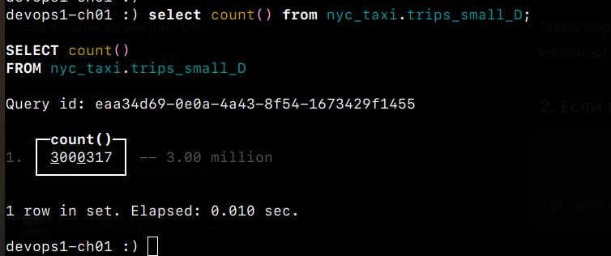

# Получение информации о кластере

Результат выполнения запроса о получении информации о кластере представлен в файле: clusters.txt

Топология кластера: topology.xml
Описание clickhouse-keeper: keeper.xml

# Проверка получения данных из distributed таблицы

