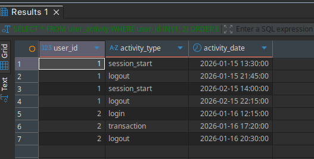
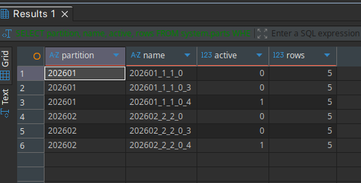
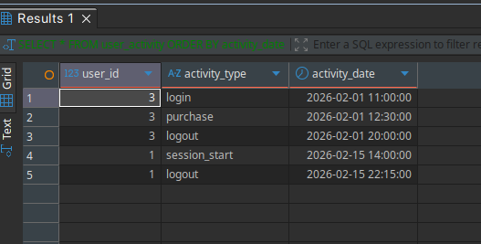
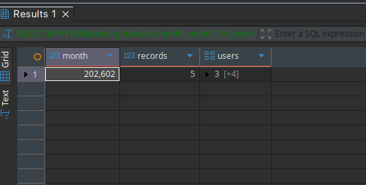

# Создание таблицы

```sql
CREATE TABLE user_activity (
    user_id UInt32,
    activity_type String,
    activity_date DateTime DEFAULT now()
) ENGINE = MergeTree()
PARTITION BY toYYYYMM(activity_date)
ORDER BY (activity_date, user_id);
```

# Вставка данных и выполнение мутации

```sql
INSERT INTO user_activity VALUES
    (1, 'login', '2026-01-15 10:30:00'),
    (1, 'logout', '2026-01-15 18:45:00'),
    (2, 'login', '2026-01-16 09:15:00'),
    (2, 'purchase', '2026-01-16 14:20:00'),
    (2, 'logout', '2026-01-16 17:30:00'),
    (3, 'login', '2026-02-01 08:00:00'),
    (3, 'purchase', '2026-02-01 09:30:00'),
    (3, 'logout', '2026-02-01 17:00:00'),
    (1, 'login', '2026-02-15 11:00:00'),
    (1, 'logout', '2026-02-15 19:15:00');

ALTER TABLE user_activity UPDATE activity_type = 'session_start' WHERE user_id = 1 AND activity_type = 'login';
ALTER TABLE user_activity UPDATE activity_type = 'transaction' WHERE user_id = 2 AND activity_type = 'purchase';
```

# Проверка состояния таблицы

```sql
SELECT * FROM user_activity WHERE user_id IN (1, 2) ORDER BY user_id, activity_date;
```




# Проверка существующих партиций

```sql
SELECT 
    partition,
    name,
    active,
    rows
FROM system.parts 
WHERE table = 'user_activity'
ORDER BY partition;
```




# Удаление партиции и проверка данных

```sql
ALTER TABLE user_activity DROP PARTITION '202601';
SELECT * FROM user_activity ORDER BY activity_date;
```




# Проверка, что данные за январь удалены

```sql
SELECT 
    toYYYYMM(activity_date) AS month,
    count(*) AS records,
    groupArray(user_id) AS users
FROM user_activity 
GROUP BY month
ORDER BY month;
```

