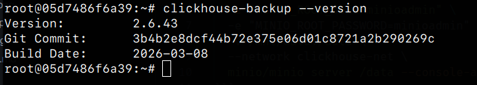
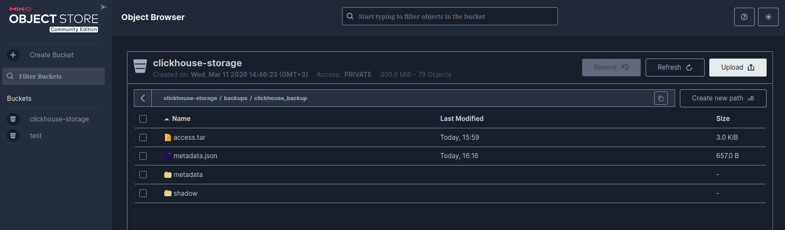
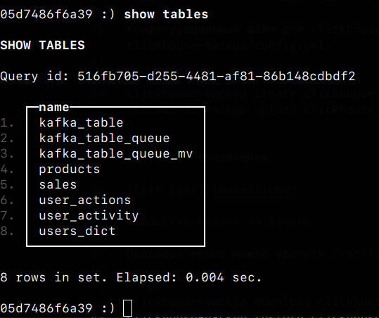

# Развертываем minio с помощью docker

```sh
docker run -d -p 9002:9000 -p 9001:9001 \
  --name minio \
  -e "MINIO_ROOT_USER=minioadmin" \
  -e "MINIO_ROOT_PASSWORD=minioadmin" \
  -v /mnt/data:/data \
  --network clickhouse-net \
  minio/minio server /data --console-address ":9001"
```

# Устанавливаем clickhouse-backup

```sh
wget https://github.com/Altinity/clickhouse-backup/releases/download/v2.6.43/clickhouse-backup-linux-amd64.tar.gz
mkdir /opt/clickhouse-backup
tar -zxf clickhouse-backup-linux-amd64.tar.gz -C /opt/clickhouse-backup
sudo cp /opt/clickhouse-backup/build/linux/amd64/clickhouse-backup /usr/local/bin/
```



# Сделаем бэкап с помощью clickhouse-backup утилиты

Конфигурационный файл для clickhouse-backup представлен в config.yml. На локальной машине он лежит в /etc/clickhouse-backup/config.yml.

```sh
clickhouse-backup create clickhouse_backup
clickhouse-backup upload clickhouse_backup
```

Результат выполнения



# Восстановление из бэкапа

Предварительно можно удалить /var/lib/clickhouse/*

```sh
clickhouse-backup download clickhouse_backup
clickhouse-backup restore clickhouse_backup
```

Данные были успешно восстановлены


