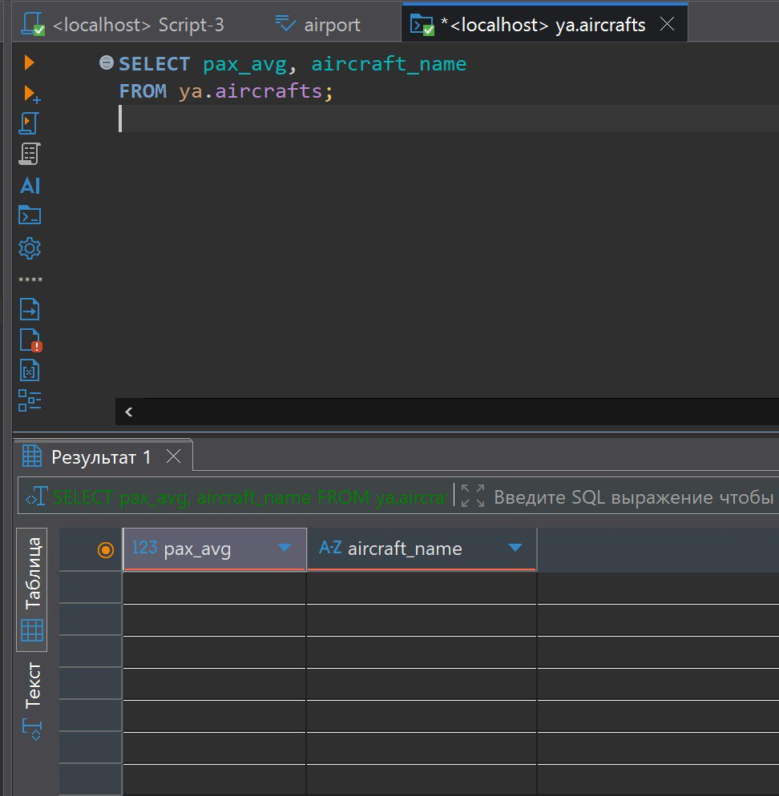
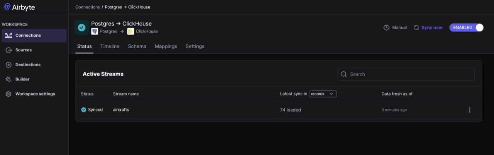
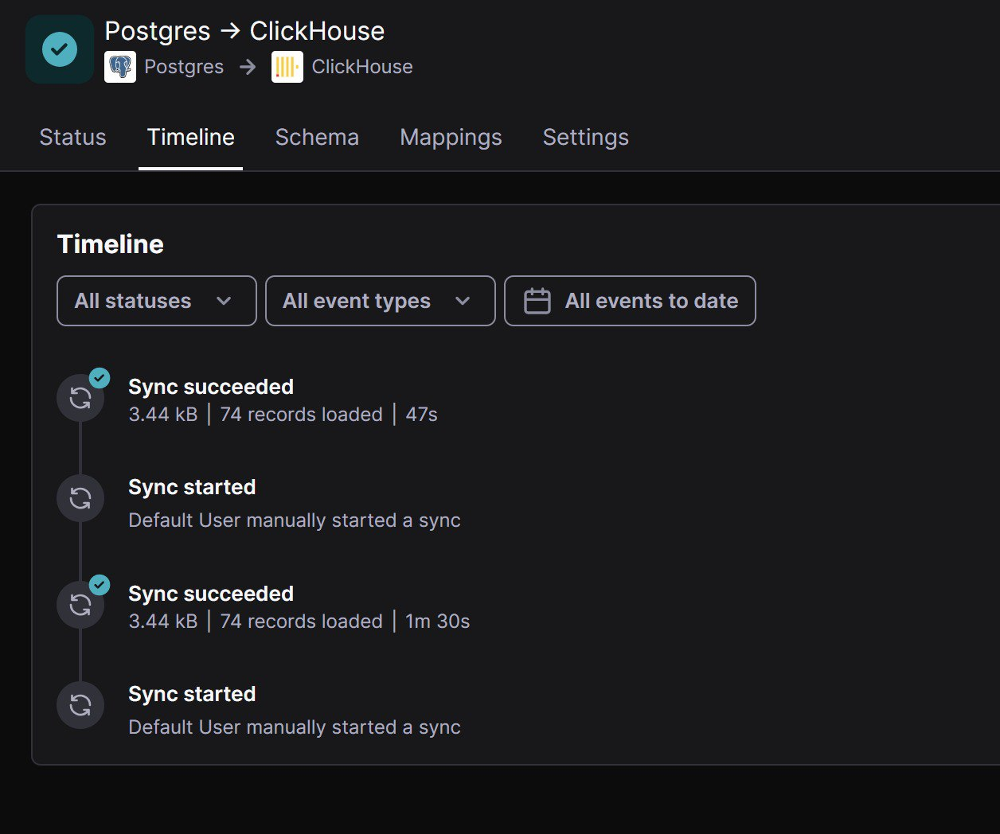
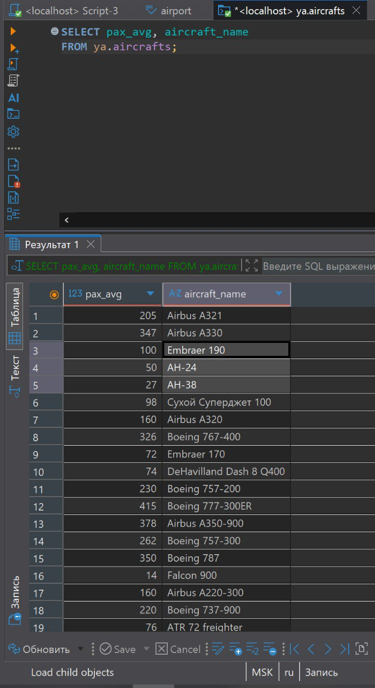

# Настройка переливания данных из PostgreSQL в ClickHouse

1. Установил airbyte
2. Создал таблицу ya.aircrafts в clickhouse
3. Проверил наличие данных в таблице в postgres
4. Запустил переливку данных

---

---

---
