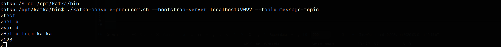
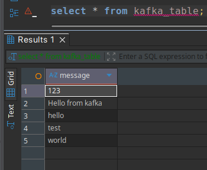

# Создание таблицы

```sql
CREATE TABLE kafka_table
(
    message String
)
ENGINE = MergeTree 
ORDER BY message;
```

# Создание таблицы с Kafka движком

```sql
CREATE TABLE kafka_table_queue
(
    message String
)
ENGINE = Kafka
SETTINGS 
    kafka_broker_list = 'kafka:9092', 
    kafka_group_name = 'kafka_group_name',
    kafka_topic_list = 'message-topic', 
    kafka_format = 'CSV',
    kafka_num_consumers = 1, 
    kafka_skip_broken_messages = 10,
    kafka_row_delimiter = '\n',
    kafka_thread_per_consumer = 0;
```

# Создание материализованного представления

```sql
CREATE MATERIALIZED VIEW kafka_table_queue_mv TO kafka_table
( 
    message String 
) AS SELECT message FROM kafka_table_queue;
```

# Запуск кафка в docker

```text
docker run -d \
  --name kafka \
  -p 9092:9092 \
  -e KAFKA_NODE_ID=1 \
  -e KAFKA_PROCESS_ROLES='broker,controller' \
  -e KAFKA_CONTROLLER_QUORUM_VOTERS='1@localhost:9093' \
  -e KAFKA_LISTENERS='PLAINTEXT://0.0.0.0:9092,CONTROLLER://0.0.0.0:9093' \
  -e KAFKA_ADVERTISED_LISTENERS='PLAINTEXT://kafka:9092' \
  -e KAFKA_LISTENER_SECURITY_PROTOCOL_MAP='CONTROLLER:PLAINTEXT,PLAINTEXT:PLAINTEXT' \
  -e KAFKA_INTER_BROKER_LISTENER_NAME='PLAINTEXT' \
  -e KAFKA_CONTROLLER_LISTENER_NAMES='CONTROLLER' \
  -e KAFKA_LOG_DIRS='/var/lib/kafka/data' \
  -e KAFKA_AUTO_CREATE_TOPICS_ENABLE='true' \
  -e KAFKA_OFFSETS_TOPIC_REPLICATION_FACTOR=1 \
  apache/kafka:latest
```

# Проверка данных в clickhouse после отправки сообщений в kafka




```sql
select * from kafka_table;
```


