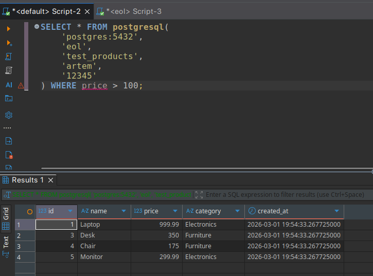
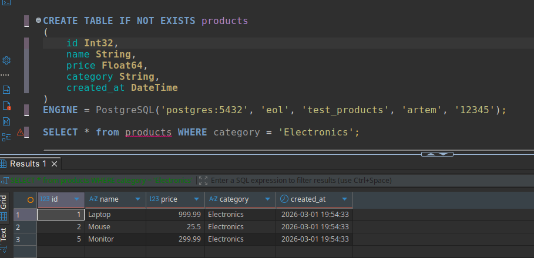
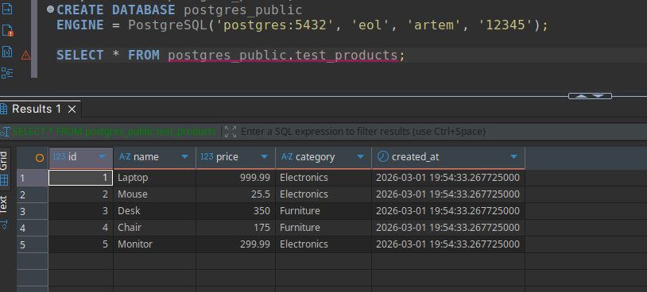

# Создание тестовой базы данных в postgresql

Создание базы данных и вставка данных

```sql
CREATE TABLE test_products (
    id SERIAL PRIMARY KEY,
    name VARCHAR(100),
    price DECIMAL(10,2),
    category VARCHAR(50),
    created_at TIMESTAMP DEFAULT NOW()
);

INSERT INTO test_products (name, price, category) VALUES
    ('Laptop', 999.99, 'Electronics'),
    ('Mouse', 25.50, 'Electronics'),
    ('Desk', 350.00, 'Furniture'),
    ('Chair', 175.00, 'Furniture'),
    ('Monitor', 299.99, 'Electronics');
```

# Запрос к postgres через clickhouse

```sql
SELECT * FROM postgresql(
    'postgres:5432',
    'eol',
    'test_products',
    'artem',
    '12345'
) WHERE price > 100;
```




# Создание таблицы с движком PostgreSQL

```sql
CREATE TABLE IF NOT EXISTS products
(
    id Int32,
    name String,
    price Float64,
    category String,
    created_at DateTime
)
ENGINE = PostgreSQL('postgres:5432', 'eol', 'test_products', 'artem', '12345');

SELECT * from products WHERE category = 'Electronics';
```




# Создание базы данных в движком PostgreSQL

```sql
drop database postgres_public;
CREATE DATABASE postgres_public
ENGINE = PostgreSQL('postgres:5432', 'eol', 'artem', '12345');

SELECT * FROM postgres_public.test_products;
```

